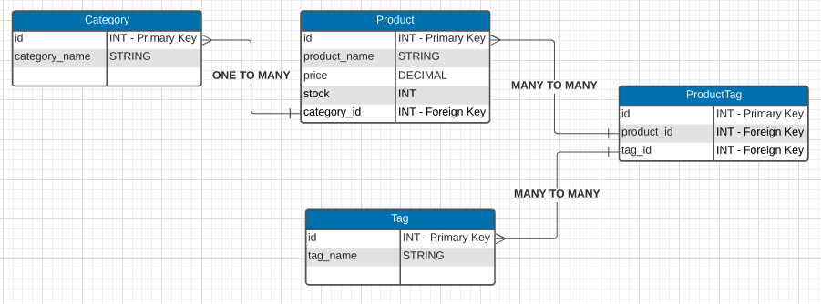
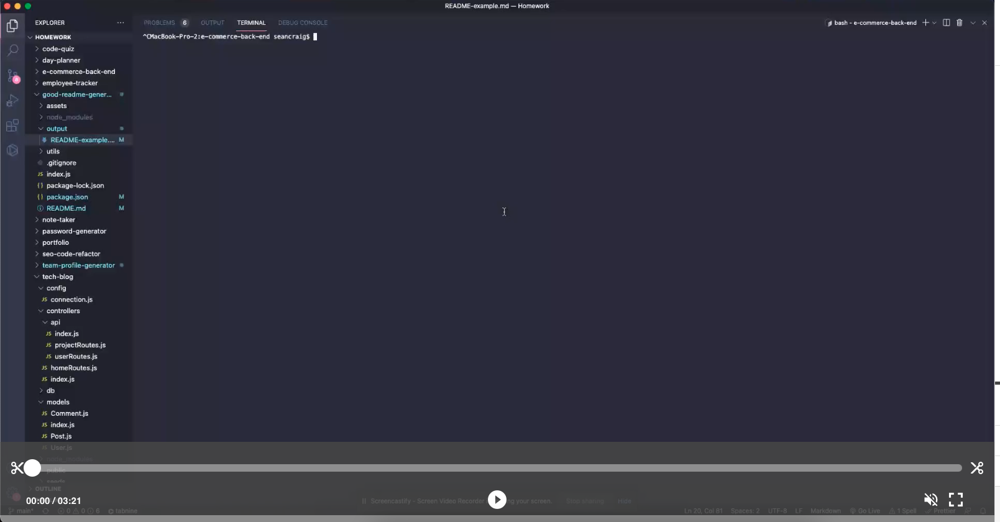

# E-Commerce Back-End

  

  ## Description
  A back end for my e-commerce website.

  The ERD (Entity Relationship Diagram) I created for the project.

  

  Link to video walk-through

  

  ## Table of Contents
  - [Installation](#installation)
  - [Usage](#usage)
  - [Credits](#credits)
  - [License](#license)
  - [Contributing](#contributing)
  - [Tests](#tests)
  - [Questions](#questions)

  ## Installation 
  Use git clone to clone the repository on your local machine and then run npm i

  ## Usage 
  Create the database by running mysql -u root -p and then enter your password. Next run source db/schema.sql; from the mysql prompt, then exit; After that run node seeds/index.js to seed the database and finally npm start to start the server. Once the server is started use an API client, such as Insomnia or Postman to mock the front end.

  ## Credits 
  Sean Craig

  ## License 
  [License MIT](https://opensource.org/licenses/MIT)

  ## Contributing
  Pull requests are welcome. For major changes, please open an issue first to discuss what you would like to change.

  ## Tests
  There are currently no tests for this project.

  ## Questions
  If you have any questions about this project please send me an email at seancraig21@gmail.com or reach out to me on Github my username is seanscraig
